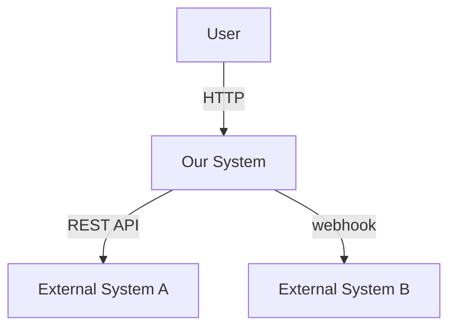
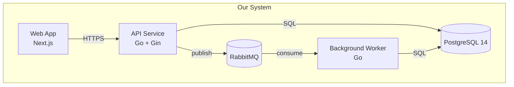
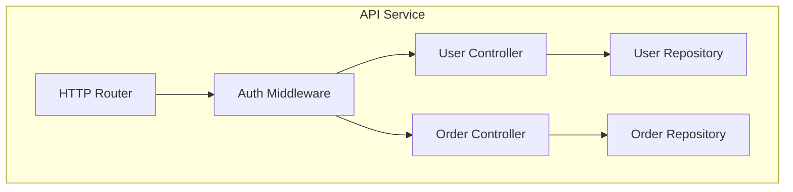

# ADR / C4 / Tech Radar Authoring

## Purpose

Produce spec deliverables in the industry-standard ADR + C4 + Tech Radar format. This is the canonical output format for Phase 5 spec authoring and Phase 6 review. Spec Writer invokes this skill once per spec; Spec Reviewer invokes the validation portion to verify conformance.

## When to Use

- **Phase 5 (Spec Authoring)**: Spec Writer applies all three formats to produce the deliverable.
- **Phase 6 (Review)**: Spec Reviewer applies the validation checklist.
- **Solution Analyst (Phase 2-3)**: Use the Tech Radar tagging schema when classifying technology candidates.

## Method

### Part 1 — ADR (Architecture Decision Record)

Every architecture decision in the spec produces one ADR file: `phase-5-spec/adrs/adr-{NNN}-{kebab-title}.md`.

#### ADR Format

```markdown
# ADR-{NNN}: {Decision Title in Active Voice}

## Status
{Proposed | Accepted | Superseded by ADR-XXX | Deprecated}

## Date
{YYYY-MM-DD}

## Context
{Problem description. What forces motivate this decision? What constraints apply? Reference Requirements Summary section IDs and Source Registry source_ids.}

## Decision
{The decision in active voice. "We will use {X} because {Y}." Single decision per ADR.}

## Consequences

### Positive
- {Specific benefit, with source_id where applicable}

### Negative
- {Specific cost, drawback, or limitation}

### Trade-offs
- {What we give up by choosing this option}

## Alternatives Considered

### {Alternative 1}
- Why considered: {reason}
- Why rejected: {reason with source_id citation}

### {Alternative 2}
- Why considered: {reason}
- Why rejected: {reason with source_id citation}

## Layer-A/B/C Existence Proof
- Layer-A (component): {evidence with source_id, or "no Layer-A evidence — first-of-kind component"}
- Layer-B (orchestration): {evidence, or "no Layer-B evidence — pattern is Layer-C inference"}
- Layer-C disclosure: {if applicable, state inference and missing public production cases}
```

#### ADR Authoring Rules

1. **Single decision per ADR** — Do not combine multiple decisions in one record.
2. **Active voice** — "We will use PostgreSQL", not "PostgreSQL should be used".
3. **Numbered sequentially** — `adr-001`, `adr-002`. Numbers do not reset across consultations within the same `.worklog/.../phase-5-spec/adrs/` folder.
4. **Status transitions** — `Proposed` → `Accepted` after user confirmation. Never directly to `Accepted` without user approval. `Superseded` requires the new ADR's number.
5. **Mandatory `source_id` citations** in Context, Consequences, and Alternatives sections.

### Part 2 — C4 Model Diagrams

Spec deliverables include C4 diagrams at three levels: Context, Container, Component. (Code-level rarely diagrammed.)

#### Diagram Files

Stored at `phase-5-spec/diagrams/c4-{level}-{name}.md`. Each file contains a Mermaid diagram and a legend.

**Level 1 — System Context** (one per consultation):



Legend: who uses the system, what external systems it depends on. No internal structure.

**Level 2 — Container** (one per consultation, sometimes multiple):



Legend: containers (deployable units), tech stack per container, communication protocols.

**Level 3 — Component** (one per significant container):



Legend: components within a container, dependencies between components.

#### C4 Authoring Rules

1. **Mermaid syntax only** — No mixed diagram tools. Mermaid renders inline in Markdown.
2. **One file per level per scope** — Do not put L1 and L2 in the same file.
3. **Legend mandatory** — Every diagram has a numbered legend describing each box and arrow.
4. **No L4 unless requested** — Code-level diagrams (class diagrams) are rarely needed and are out of scope by default.

### Part 3 — Tech Radar Tagging

Every technology candidate referenced in a spec carries a Tech Radar ring assignment:

| Ring | Meaning | When to use |
|------|---------|-------------|
| Adopt | Default for new work; production-proven | Layer-A and Layer-B evidence both present |
| Trial | Validated, used in limited scope | Layer-A present; Layer-B partial |
| Assess | Watching, researching | Layer-A partial; Layer-B inference only |
| Hold | Do not start new projects | Deprecated, contradicted by evidence, or superseded |

Tech Radar tags appear in:
- ADR Decision section: "We will use {tech} (Tech Radar: Adopt) because..."
- Container diagram legends: "API Service — Go + Gin (Adopt)"
- Spec summary table: column "Tech Radar"

When the team's Tech Radar position differs from ThoughtWorks Tech Radar Vol.34 [SRC-017], state the divergence and cite local evidence.

### Part 4 — Cross-format Consistency

The spec deliverable's three artifacts (ADRs, C4 diagrams, Tech Radar tags) must reference the same names, the same versions, and the same components. Spec Reviewer checks:

- Every container in C4 L2 has at least one ADR explaining its tech choice
- Every tech in C4 legends has a Tech Radar tag
- Every ADR's Decision references at least one C4 element by name

## Examples

### Normal case: Database-choice ADR

Context: E-commerce backend, 50K product catalog, 500 concurrent users, team knows PostgreSQL.

ADR-001 fills the format above with:
- **Decision**: "We will use PostgreSQL 14 as primary OLTP store with pg_trgm for full-text search and Redis cache for read-heavy product views."
- **Positive**: team expertise removes learning curve [SRC-100]; ACID matches order-write requirement [SRC-101]; pg_trgm covers search at this scale [SRC-102]
- **Negative**: pg_trgm search relevance below Elasticsearch at >1M records; vertical-only scaling
- **Alternatives**: MongoDB + Atlas (rejected: team lacks operational experience, vendor lock-in); PostgreSQL + Elasticsearch (rejected: over-engineering for 50K records)
- **Layer-A/B/C**: Layer-A PostgreSQL 14 verified [SRC-101]; Layer-B PostgreSQL + Redis pattern mainstream [SRC-104]

### Edge case: Tech Radar position differs from ThoughtWorks

Spec includes a tech with ThoughtWorks Tech Radar Vol.34 = ASSESS, but the team has Layer-A + Layer-B production evidence in their specific context. ADR Decision states: "We will use {tech} (Tech Radar: Trial — local evidence overrides ThoughtWorks ASSESS [SRC-017]; see Layer-B evidence below)." Spec Reviewer accepts the divergence when local evidence is in the Source Registry.

### Rejection case: ADR with multiple decisions combined

Draft ADR-005: "Use PostgreSQL and adopt event sourcing and use Kafka..." Spec Reviewer rejects: split into ADR-005 (PostgreSQL), ADR-006 (Event Sourcing), ADR-007 (Kafka). Each decision deserves separate Context / Consequences / Alternatives.

## References

- `rules/evidence-standards.md` — Source citation requirements
- Survey-Corps report §10.2 — ADR + C4 + Tech Radar golden trio
- Survey-Corps report §10.3 — ADR best-practices specification
- Survey-Corps report §10.4 — Tech Radar Vol.34 ratings index
- Michael Nygard, 2011 — Original ADR essay (foundational source [SRC-015])
- Simon Brown, C4 model — Foundational diagram methodology [SRC-016]
