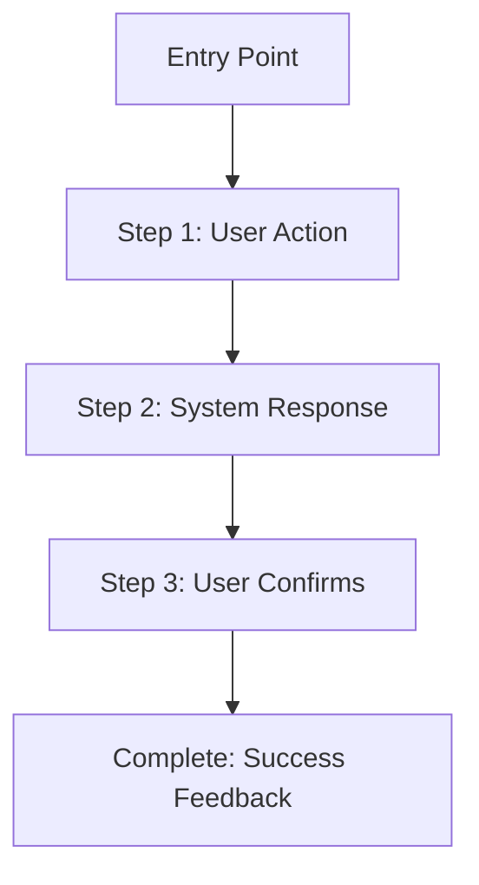
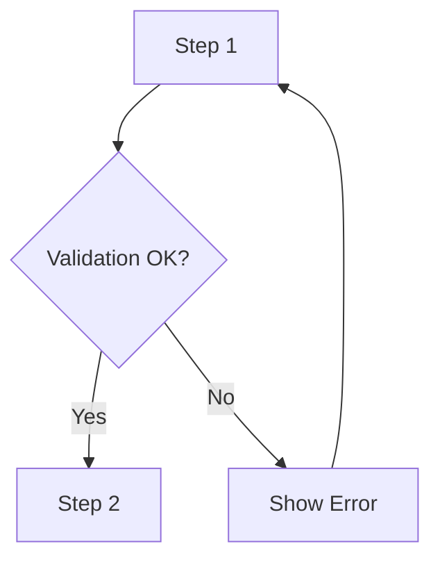
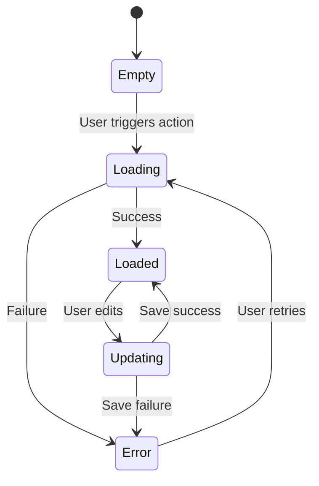
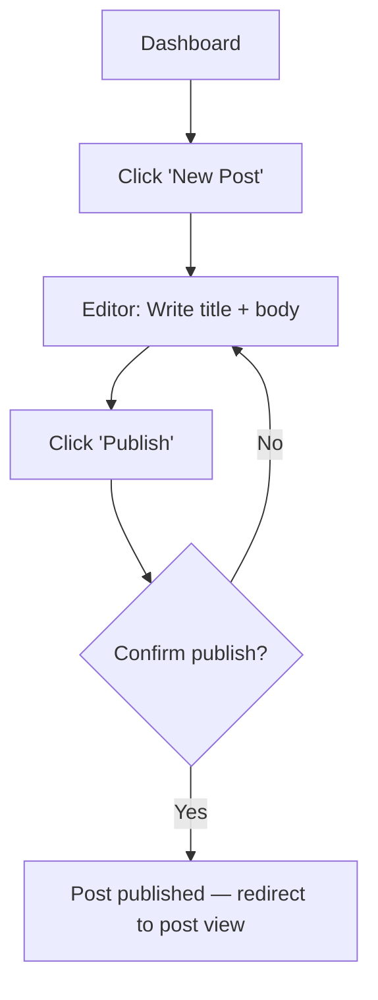
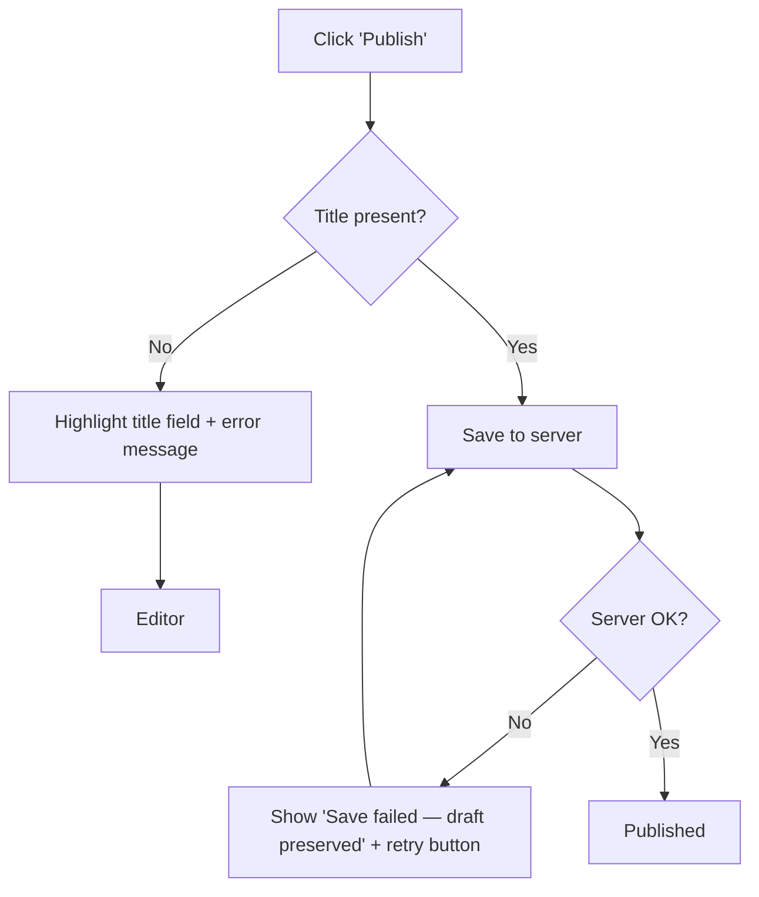

# UX Flow Design

## Purpose

Provide a structured method for designing user flows that cover happy paths, error paths, and state transitions, producing implementable UX specifications using Mermaid diagrams.

## When to Use

Use this skill during Phase 4 (UX/Flow Design) when the UX Designer needs to map out user journeys for core features.

## Method

### Step 1: Identify Core Tasks

From the Requirements Summary, extract every distinct task a user needs to accomplish. Prioritize by frequency of use:
- **Primary tasks**: Actions users perform daily (e.g., create, search, view)
- **Secondary tasks**: Actions users perform occasionally (e.g., configure settings, export data)
- **Rare tasks**: Actions users perform rarely but must work reliably (e.g., password reset, account deletion)

### Step 2: Map Happy Path

For each primary task, draw the simplest path from start to completion:

Rules:
- Maximum 7 steps in a happy path. If more steps are needed, the task must be broken into sub-tasks.
- Every step must define both the user action and the system response.

### Step 3: Add Error Paths

For each step in the happy path, identify what can go wrong and design the recovery:

Rules:
- Every error must show a clear message explaining what happened and how to fix it.
- The user must never reach a dead end — every error path must lead back to a recoverable state.

### Step 4: Define States

Map all possible states the system can be in for this feature:

### Step 5: Validate

Check each flow against these criteria:
- Can the user complete the task in under 7 steps?
- Is every error state recoverable?
- Are loading states accounted for?
- Does the flow use standard interaction patterns (no custom behaviors where standard ones work)?

## Examples

### Normal case: User creates a new blog post in a CMS

**Happy Path**:

**Error Path**:

**States**: Empty → Drafting → Saving → Published / Error

| State | User Sees | Available Actions |
|-------|----------|-------------------|
| Empty | Blank editor with placeholder text | Type, cancel |
| Drafting | Editor with content, auto-save indicator | Type, preview, publish, discard |
| Saving | Editor with spinner overlay | Wait |
| Published | Post view with success message | Edit, share, back to dashboard |
| Error | Editor with error banner, content preserved | Retry, save as draft |

### Edge case: Offline-first task with sync conflicts

Task: User edits a customer record on a mobile app while offline; conflict on sync because another user edited the same field online.

Flow design adds: (1) offline-state banner during disconnection; (2) local-only "save" semantics shown to user; (3) conflict-resolution dialog on reconnect with "Keep mine / Keep theirs / Merge" options; (4) merge view shows side-by-side diff; (5) post-merge confirmation.

States: Empty → Drafting (offline) → Local-saved → Sync-pending → Conflict → Resolved.

### Rejection case: Happy path exceeds 7 steps

Draft flow for "user purchases a subscription" lists 11 steps from landing-page to confirmation. Per Step 2 rule, max 7 steps in a happy path.

Action: split into two flows — "select plan" (4 steps) and "complete payment" (5 steps), with a clear handoff (cart-summary screen) between them. Each flow now satisfies the 7-step ceiling and has its own error paths.
